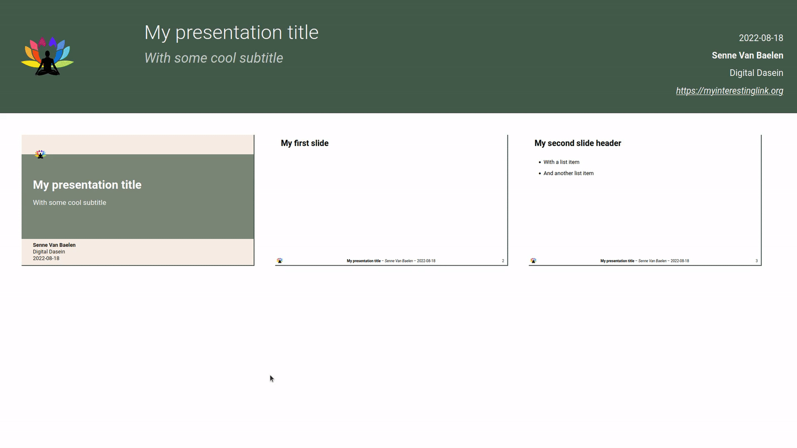

<!--
SPDX-FileCopyrightText: 2022 Digital Dasein <https://digitaldasein.org/>
SPDX-FileCopyrightText: 2022 Senne Van Baelen <senne@digitaldasein.org>
SPDX-FileCopyrightText: 2022 Gerben Peeters <gerben@digitaldasein.org>

SPDX-License-Identifier: MIT
-->

[quick start](#quick-start) &nbsp;&ndash;&nbsp; [features](#features) 
&nbsp;&ndash;&nbsp; [docs](#docs) &nbsp;&ndash;&nbsp; [examples](#examples) 
&nbsp;&ndash;&nbsp; [development](#development) &nbsp;&ndash;&nbsp; 
[attribution](#attribution) &nbsp;&ndash;&nbsp; [licenses](#licenses)


# Compono


[](https://api.reuse.software/info/github.com/digitaldasein/compono)

A batteries-included **command-line utility** for **creating**, **publishing**, 
and **archiving** component-based **HTML presentations**.  Quickly develop 
content by exploiting a set of (native) [web 
components](https://developer.mozilla.org/en-US/docs/Web/Web_Components), 
included via the [`libcompono` 
library](https://github.com/digitaldasein/libcompono).

## Quick start

<b>Download</b> the [latest 
release](https://github.com/digitaldasein/compono/releases/latest) and move the 
binary to a convenient location on your system (e.g.  `/usr/local/bin/`).

Initialise <b>new, empty presentation</b>:

```
compono create
```

Initialise an <b>example presentation</b>, including the 
[`shower`](https://github.com/shower/shower) and 
[`mathjax`](https://www.mathjax.org/) libraries, as well as the 
[`dd-basic`](./src/styles/dd_basic.css) <b>theme</b>:

```sh
compono create --theme dd-basic --template example --shower --mathjax
```
(<i>short version</i>: `compono create -t dd-basic -T example -s -m`)

The output of this command is [available 
here](https://digitaldasein.github.io/compono/example-dd-basic/).

## Features

- Batteries included: a **single (*static*) binary** (~5MB)
- Generates an <b>all-local</b> HTML presentation base, no internet connection 
  required!
- Built-in, *customisable* **web components**,  **stylesheets** and **HTML 
  templates**
- Automatically publish your presentation to **Gitlab**, **Github**, or to a 
  **remote server**
- **Archive** and **compress** your presentation to a `.tar.gz`- or 
  `.zip`-file

## Docs

- [Creating a presentation](#create)
- [Publishing a presentation](#publish)
- [Archiving a presentation](#archive)
- [Custom web components](#custom-web-components)

### Available options and subcommands

```sh
USAGE:
    compono <SUBCOMMAND>

OPTIONS:
    -h, --help       Print help information
    -V, --version    Print version information

SUBCOMMANDS:
    archive    Archive presentation (tar.gz or zip) [aliases: zip, bundle]
    create     Initialise new HTML presentation [aliases: init, new]
    help       Print this message or the help of the given subcommand(s)
    publish    Publish HTML presentation [aliases: pub]
```

### Create

```bash
USAGE:
    compono create [OPTIONS]

OPTIONS:
    -c, --css-path <CSS_PATH>
            Path to custom CSS stylesheet

    -f, --filename <FILENAME>
            filename HTML output

    -h, --help
            Print help information

    -m, --mathjax
            Include mathjax engine for rendering math (LaTeX-like)

    -n, --no-inline-fonts
            Do not inline font binaries in CSS (applicable to most themes)

    -o, --output-dir <OUTPUT_DIR>
            Output directory path [default: ./]

    -p, --template-path <TEMPLATE_PATH>
            Path to custom HTML template

    -s, --shower
            Include shower presentation javascript core

    -t, --theme <THEME>
            Theme (CSS styles). For a custom css path, see the `--css-path`
            option [default: none] [possible values: none, dd-vars, dd-basic]

    -T, --template <TEMPLATE>
            Use HTML template for presentation. For a custom template path, see
            the `--template-path` option [default: minimal] [possible values:
            minimal, minimal-vim, css-vars, example, example-css-vars]

    -V, --version
            Print version information
```

### Publish

_Note that by default, the `src` tags in the index.html are checked to 
determine which files to **include for publishing**. Alternative methods can be 
set with the `--method` option._

```bash
Publish HTML presentation

USAGE:
    compono publish [OPTIONS]

OPTIONS:
    -c, --commit <COMMIT>
            Git commit message when pushing to remote [default: "Publish HTML
            presentation"]

    -e, --endpoint <ENDPOINT>
            Remote endpoint (IP address/URL) (for `scp` method)

    -h, --help
            Print help information

    -i, --input-dir <INPUT_DIR>
            Path to presentation directory [default: ./]

    -I, --include <INCLUDE>
            Determine which files to include for publishing. By default, the
            `src` tags in the index.html are checked [default: use-html]
            [possible values: use-html, use-gitignore, all]

    -m, --method <METHOD>
            Publication method [default: auto] [possible values: auto, github,
            gitlab, scp]

    -o, --output-dir <OUTPUT_DIR>
            Remote output directory (for `scp` method). Is directory does not
            exist, it will automatically be created [default: $HOME/<input-dir>]

    -p, --ssh-pass <SSH_PASS>
            SSH passphrase for gitlab/github [default: None]

    -s, --ssh-key <SSH_KEY>
            Path to SSH key for gitlab/github authentication [default:
            $HOME/.ssh/id_ed25519]

    -u, --username <USERNAME>
            Remote server username (for `scp` method)

    -V, --version
            Print version information
```

### Archive

_Note that by default, the `src` tags in the index.html are checked to 
determine which files to **include for publishing**. Alternative methods can be 
set with the `--method` option._

```bash
Archive presentation (tar.gz or zip)

USAGE:
    compono archive [OPTIONS]

OPTIONS:
    -f, --filename <FILENAME>
            Output filename without extension [default: present-<date>]

    -h, --help
            Print help information

    -i, --input-dir <INPUT_DIR>
            Path to presentation directory [default: ./]

    -I, --include <INCLUDE>
            Determine which files to include for publishing. By default, the
            `src` tags in the index.html are checked [default: use-html]
            [possible values: use-html, use-gitignore, all]

    -m, --method <METHOD>
            Set archive and compression method (`zip-stored` = not compressed)
            [default: tar] [possible values: tar, zip, zip-stored]

    -o, --output-dir <OUTPUT_DIR>
            Output directory [default: ./]

    -V, --version
            Print version information
```

### Custom web components

Check out documentation for all [included web 
components](https://github.com/digitaldasein/libcompono):

- [dd-grid](https://digitaldasein.github.io/dd-grid/docs/classes/DdGrid.html)
- [dd-code](https://digitaldasein.github.io/dd-code/docs/classes/DdCode.html)
- [dd-footer](https://digitaldasein.github.io/dd-footer/docs/classes/DdFooter.html)
- [dd-titlepage](https://digitaldasein.github.io/dd-titlepage/docs/classes/DdTitlepage.html)
- [dd-slide](https://digitaldasein.github.io/dd-slide/docs/classes/DdSlide.html)
- [dd-slide-collection](https://digitaldasein.github.io/dd-slide-collection/docs/classes/DdSlideCollection.html)

## Examples

&rarr; [See here for <b>example commands</b> and <b>published</b> 
presentations](./examples)

### Minimal presentation HTML

```html
<html>
  [...]
  <body>
    <dd-slide-collection main-title="My presentation title"
                         sub-title="Which might also have a subtitle"
                         author="Senne Van Baelen"
                         organisation="Digital Dasein"
                         organisation-url=""
                         date="2022-08-18"
                         url="mysite.org"
                         img-src="logo.svg"
                         img-url="">

      <!--use default footer and titlepagee-->
      <dd-footer></dd-footer>
      <dd-titlepage></dd-titlepage>

      <dd-slide>
        <h2>My first slide</h2>
        <ul>
          <li>Some important item</li>
          <li>Another important item</li>
        </ul>
      </dd-slide>

      <dd-slide dim="70 30; 50 50" slot-style="border: 1px solid black;">
        <h2>My second slide is a 2 x 2 grid</h2>
        <div slot="1">
          This slot is a 70% width column
          <h4>Nest whatever you want here.</h4>
        </div>
        <div slot="2">This is the second slot, only 30% width</div>
        <div slot="3">
          And now for slot 3 (second row) at <b>50% width</b>
          <br>
        </div>
        <!-- NO slot 4, so an auto-filler is rendered-->
      </dd-slide>

    </dd-slide-collection>
  </body>
</html>
```
<b>Output:</b>



## Development

### Submodules

#### Install/update

```sh
git submodule update --init --recursive --remote --merge
```

#### Build libcompono

```sh
cd lib/libcompono \
  && yarn install \
  && yarn build
```

#### Build shower

```sh
cd lib/libcompono && yarn build:shower
```

#### Install MathJax

```sh
cd lib/mathajx && yarn install
```

### Compono crate (Rust)

Run program:
```
cargo run -- <subcommand> [OPTIONS]
```

Build:

```sh
cargo build
```

### Run utils (optional)

```sh
cd utils && cargo run
```

## Attribution

### [Shower](https://github.com/shower/shower)
[`libcompono`](https://github.com/digitaldasein/libcompono) is heavily inspired 
by the [Shower presentation 
engine](https:/https://github.com/digitaldasein/libcompono/github.com/shower/shower). 
The 
[`dd-slide-collection`](https://digitaldasein.github.io/dd-slide-collection/docs/classes/DdSlideCollection.html) 
component in particular adopted several features and styles from Shower.

Even more so, `libcompono` is **fully compatible** with the [shower 
core](https://github.com/shower/core/), which can be automatically included 
using the `--shower` option when creating a presentation.

As such, the Shower core can **extend** the basic `compono` components, which 
aim to merely possess a limited (yet practical) set of functionalities.

Big thanks to all the Shower contributors!

## Licenses

(See also file headers and [REUSE 
status](https://api.reuse.software/info/github.com/digitaldasein/compono))

In summary, the available [licenses](./LICENSES) are applied to the following 
software:
- <b>MIT</b>: `compono` utility,
  [`libcompono`](https://github.com/digitaldasein/libcompono),
  all `dd-components`, [shower presentation 
  core](https://github.com/shower/core/)
- <b>Apache-2.0</b>: Google's [Roboto 
  Font](https://en.wikipedia.org/wiki/Roboto)
- <b>BSD-3-Clause:</b>: All `dd-components` use the [lit 
  library](https://lit.dev/docs/), which is licensed under BSD-3-Clause. Hence, 
  the production-ready build of the `libcompono` library&mdash;used in the 
  [examples](./examples)&mdash;adopts these for the `lit` portion of the code.
