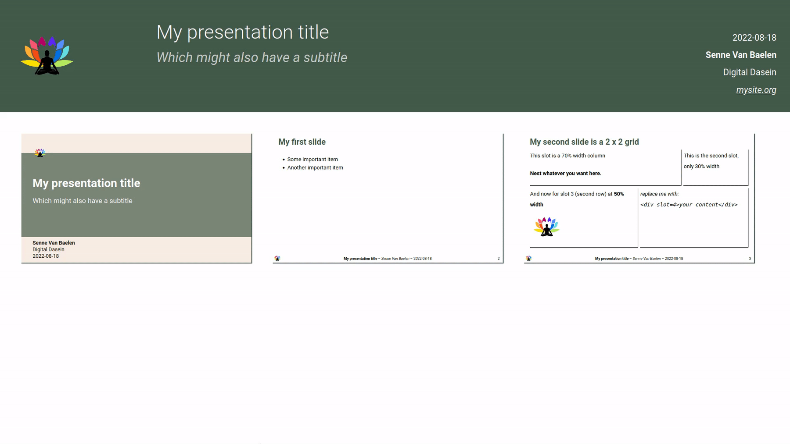

<!--
SPDX-FileCopyrightText: 2022 Digital Dasein <https://digital-dasein.gitlab.io/>
SPDX-FileCopyrightText: 2022 Senne Van Baelen <senne@digitaldasein.org>
SPDX-FileCopyrightText: 2022 Gerben Peeters <gerben@digitaldasein.org>

SPDX-License-Identifier: MIT
-->

[features](#features) &nbsp;&ndash;&nbsp; [docs](#docs) &nbsp;&ndash;&nbsp; 
[examples](#examples) &nbsp;&ndash;&nbsp; [development](#development) 
&nbsp;&ndash;&nbsp; [attribution](#attribution)

# Compono

A batteries-included **command-line utility** for **creating**, **publishing**, 
and **archiving** component-based **HTML presentations**.  Quickly develop 
content by exploiting a set of native [web 
components](https://developer.mozilla.org/en-US/docs/Web/Web), included via the 
[`libcompono` 
library](https://gitlab.com/digital-dasein/software/html-presentations/libcompono).

## Features

- Batteries included: a **single (*static*) binary** (~4MB)
- Built-in **stylesheets** and **HTML templates** for convenient initialisation
- Automatically publish your presentation to **Gitlab**, **Github**, or to a 
  **remote server**.
- **Archive** and **compress** your presentation to a `.tar.gz`- or 
  `.zip`-file.

## Docs

- [Creating a presentation](#create)
- [Publishing a presentation](#publish)
- [Archiving a presentation](#archive)
- [Custom HTML elements](#custom-html-elements)

### Available options and subcommands

```sh
USAGE:
    compono <SUBCOMMAND>

OPTIONS:
    -h, --help       Print help information
    -V, --version    Print version information

SUBCOMMANDS:
    archive    Archive presentation (tar.gz or zip) [aliases: zip, bundle]
    create     Initialise new HTML presentation [aliases: init, new]
    help       Print this message or the help of the given subcommand(s)
    publish    Publish HTML presentation [aliases: pub]
```

### Create

```bash
Initialise new HTML presentation

SAGE:
   compono create [OPTIONS]

PTIONS:
   -c, --css-path <CSS_PATH>
           Path to custom CSS stylesheet

   -f, --filename <FILENAME>
           filename HTML output

   -h, --help
           Print help information

   -n, --no-inline-fonts
           Do not inline font binaries in CSS (applicable to most themes)

   -o, --output-dir <OUTPUT_DIR>
           Output directory path [default: ./]

   -p, --template-path <TEMPLATE_PATH>
           Path to custom HTML template

   -s, --shower
           Include shower presentation javascript core

   -t, --template <TEMPLATE>
           Use HTML template for presentation. For a custom template path, see
           the `--template-path` option [default: minimal] [possible values:
           minimal, minimal-vim, style-props, full]

   -T, --theme <THEME>
           Theme (CSS styles). For a custom css path, see the `--css-path`
           option [default: none] [possible values: none, dd-basic,
           shower-dd-basic]

   -V, --version
           Print version information
```

### Publish

_Note that by default, the `src` tags in the index.html are checked to 
determine which files to **include for publishing**. Alternative methods can be 
set with the `--method` option._

```bash
Publish HTML presentation

USAGE:
    compono publish [OPTIONS]

OPTIONS:
    -c, --commit <COMMIT>
            Git commit message when pushing to remote [default: "Publish HTML
            presentation"]

    -e, --endpoint <ENDPOINT>
            Remote endpoint (IP address/URL) (for `scp` method)

    -h, --help
            Print help information

    -i, --input-dir <INPUT_DIR>
            Path to presentation directory [default: ./]

    -I, --include <INCLUDE>
            Determine which files to include for publishing. By default, the
            `src` tags in the index.html are checked [default: use-html]
            [possible values: use-html, use-gitignore, all]

    -m, --method <METHOD>
            Publication method [default: auto] [possible values: auto, github,
            gitlab, scp]

    -o, --output-dir <OUTPUT_DIR>
            Remote output directory (for `scp` method). Is directory does not
            exist, it will automatically be created [default: $HOME/<input-dir>]

    -p, --ssh-pass <SSH_PASS>
            SSH passphrase for gitlab/github [default: None]

    -s, --ssh-key <SSH_KEY>
            Path to SSH key for gitlab/github authentication [default:
            $HOME/.ssh/id_ed25519]

    -u, --username <USERNAME>
            Remote server username (for `scp` method)

    -V, --version
            Print version information
```

### Archive

_Note that by default, the `src` tags in the index.html are checked to 
determine which files to **include for publishing**. Alternative methods can be 
set with the `--method` option._

```bash
Archive presentation (tar.gz or zip)

USAGE:
    compono archive [OPTIONS]

OPTIONS:
    -f, --filename <FILENAME>
            Output filename without extension [default: present-<date>]

    -h, --help
            Print help information

    -i, --input-dir <INPUT_DIR>
            Path to presentation directory [default: ./]

    -I, --include <INCLUDE>
            Determine which files to include for publishing. By default, the
            `src` tags in the index.html are checked [default: use-html]
            [possible values: use-html, use-gitignore, all]

    -m, --method <METHOD>
            Set archive and compression method (`zip-stored` = not compressed)
            [default: tar] [possible values: tar, zip, zip-stored]

    -o, --output-dir <OUTPUT_DIR>
            Output directory [default: ./]

    -V, --version
            Print version information
```

### Custom HTML elements

Check out documentation for all [included web 
components](https://gitlab.com/digital-dasein/software/html-presentations/libcompono):

- [dd-grid](https://digital-dasein.gitlab.io/software/html-presentations/dd-grid/docs/classes/DdGrid.html)
- [dd-footer](https://digital-dasein.gitlab.io/software/html-presentations/dd-footer/docs/classes/DdFooter.html)
- [dd-titlepage](https://digital-dasein.gitlab.io/software/html-presentations/dd-titlepage/docs/classes/DdTitlepage.html)
- [dd-slide](https://digital-dasein.gitlab.io/software/html-presentations/dd-slide/docs/classes/DdSlide.html)
- [dd-slide-collection](https://digital-dasein.gitlab.io/software/html-presentations/dd-slide-collection/docs/classes/DdSlideCollection.html)

TODO: `dd-code` component

## Examples

### Create

- with a minimal (default) template:

  ```sh
  compono create
  ```

- with a extensively populated `template`, in a 
  (new/existing) `output directory`, with a built-in `theme`:

  ```sh
  compono create -t full -o my-out-dir -T dd-basic
  ```

- extend with features from the [Shower 
core](https://github.com/shower/shower) as backend, and include a custom CSS 
stylesheet:

  ```sh
  compono create -s -c /path/to/my/styles.css
  ```

### Publish

- to Github/Gitlab (automatically detected based on remote origin):

  ```sh
  compono publish
  ```

  &rarr; (for Github) your slides will shortly be available at: 
  `https://<subdomaim>.github.io/organisation/project`

* to Github/Gitlab, by providing a non-default SSH-key, 
  with a custom commit message:

  ```sh
  compono publish --commit "my commit msg" --ssh-key "$HOME/.ssh/id_rsa"
  ```

- to a remote endpoint (secure copy over SSH):

  ```sh
  compono publish -e mydomain.org -u myusername
  ```

  (In case authentication with SSH key fails, either with default key or set 
  with `--ssh-key`, a **fallback** for a **password** input is initiated)

- to a remote endpoint in a non-default remote directory:

  ```sh
  compono publish -e mydomain.org -u root -o "/var/www/html/my-pressie"
  ```

### Archive

- in the current directory:

  ```sh
  compono archive
  ```

  &rarr; outputs `present-<current-date>.tar.gz`

- with a custom filename, using a compressed ZIP format (deflated)

  ```sh
  compono archive -f my-pressie -m zip
  ```
  &rarr; outputs `./my-pressie.zip`

## Simple presentation example



## Development

### Submodules

#### Install/update

```sh
git submodule update --init --recursive --remote --merge
```

#### Build libcompono

```sh
cd lib/libcompono \
  && yarn install \
  && yarn build
```

#### Build shower

```sh
cd lib/libcompono && yarn build:shower
```

### Compono crate (Rust)

Run program:
```
cargo run -- <subcommand> [OPTIONS]
```

Build release:

```sh
cargo build --release
```

## Attribution

### [Shower](https://github.com/shower/shower)
[`libcompono`](https://gitlab.com/digital-dasein/software/html-presentations/libcompono) 
is heavily inspired by the [Shower presentation 
engine](https://github.com/shower/shower). The 
[`dd-slide-collection`](https://digital-dasein.gitlab.io/software/html-presentations/dd-slide-collection/docs/classes/DdSlideCollection.html) 
component in particular adopted several features and styles from Shower.

Even more so, `libcompono` is **fully compatible** with the [shower 
core](https://github.com/shower/core/), which can be automatically included 
using the `--shower` option when creating a presentation.

As such, the Shower core can **extend** the basic `compono` components, which 
aim to merely possess a limited (yet practical) set of functionalities.

Big thanks to all the Shower contributors!
